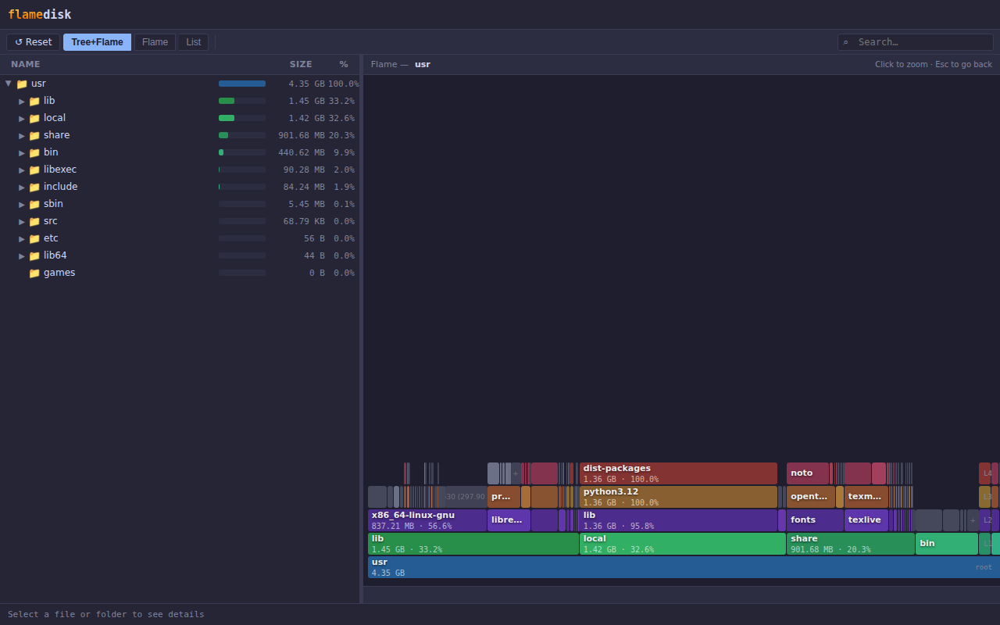
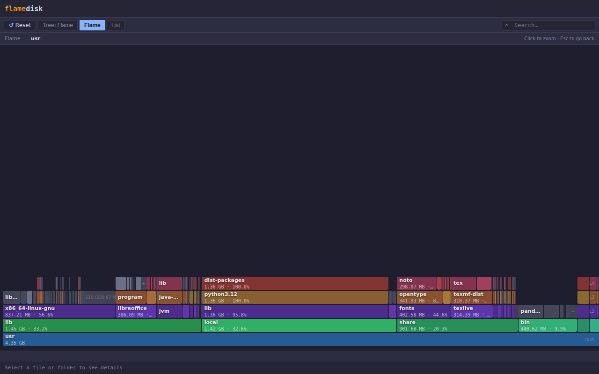
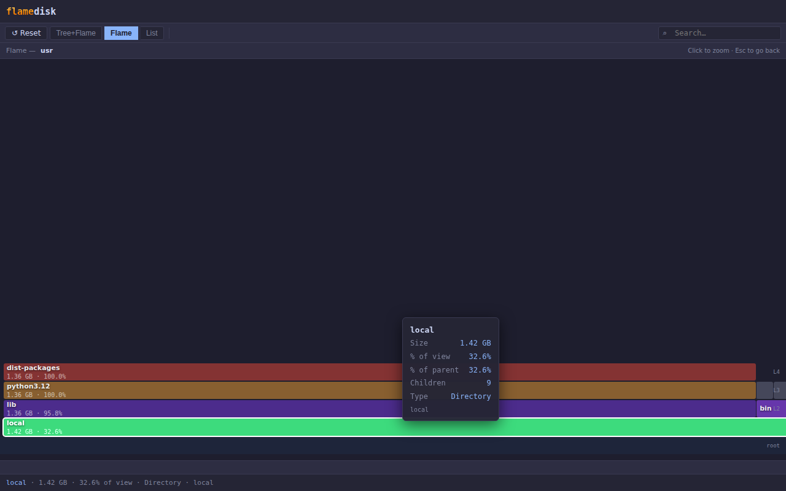
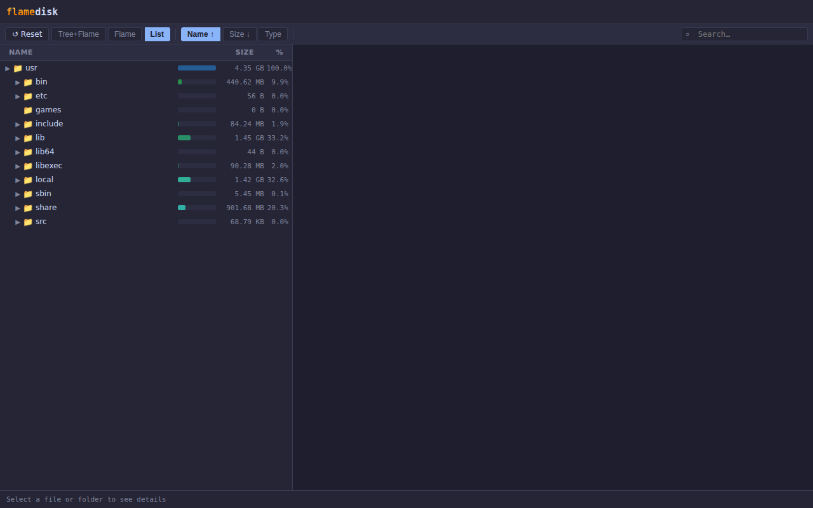

# flamedisk 🔥

Interactive disk-usage visualiser. Scan a directory and open a self-contained HTML report with a flame graph and sortable file tree — no server required.



---

## Install

```
pip install flamedisk
```

Requires Python 3.9+. No runtime dependencies beyond the standard library.

## Quick start

```
flamedisk /path/to/scan
```

The report opens in your default browser. The HTML file is fully self-contained — share it as a single file, no internet connection needed.

## CLI

```
flamedisk [path] [options]
```

| Option | Default | Description |
|---|---|---|
| `path` | `.` | Directory to scan |
| `-o FILE` / `--output FILE` | temp file | Write HTML to a specific path |
| `--depth N` | unlimited | Maximum scan depth |
| `--min-size BYTES` | `0` | Skip files smaller than this (e.g. `1MB`, `512KB`) |
| `--exclude NAME …` | — | Entry names to skip (e.g. `.git node_modules`) |
| `--follow-symlinks` | off | Follow symbolic links (beware of cycles) |
| `--workers N` | auto | Thread-pool size. Auto = `cpu_count × 4`, max 32 |
| `-q` / `--no-browser` | off | Skip opening a browser window |
| `--json` | off | Print raw JSON tree to stdout instead of HTML |
| `--title TEXT` | — | Custom HTML page title |
| `--version` | — | Print version and exit |

### Examples

```bash
# Scan home directory and open in browser
flamedisk ~

# Save report without opening browser
flamedisk /var/log -o report.html -q

# Limit depth, skip small files
flamedisk /usr --depth 4 --min-size 1MB

# Skip virtual filesystems
flamedisk / --exclude proc sys dev -q

# Path with spaces
flamedisk "/home/My Documents"

# Exclude list followed by a spaced path
flamedisk --exclude .git node_modules -- "/my project"

# Pipe JSON tree to jq
flamedisk . --json | jq '.children[0]'
```

## Python API

```python
from flamedisk import scan, write_html

tree = scan(
    "/home/user",
    max_depth=5,
    exclude=[".git", "node_modules"],
    workers=16,
)
write_html(tree, "report.html")
```

See [docs/api.md](docs/api.md) for the full API reference.

## The report

### Tree + Flame view (default)

The left panel shows an expandable file tree. The right panel shows a flame graph — each row is a depth level, each cell is a file or directory sized proportionally to disk usage. The root sits at the bottom; deeper entries grow upward.


### Flame view

The flame graph fills the full window.



### Zoom

Click any directory cell in the flame graph to zoom into it. The original colours and depth levels are preserved — the view rescales so the selected directory fills the full width. Press **Esc** or click **↺ Reset** to return.



### List view

Flat sortable list of the current directory's immediate children. Sort by **Name**, **Size**, or **Type**. The size bar and percentage column always show each entry's share of the total root directory.



### Search

Type in the search box (top-right) to highlight matching entries across all views. Matching cells are highlighted; non-matching entries are dimmed.

### Keyboard shortcuts

| Key | Action |
|---|---|
| `Esc` | Clear zoom / exit search |

## Install from source

```bash
git clone https://github.com/cryocliff/flamedisk
cd flamedisk
pip install -e ".[dev]"
```

## Development

```bash
pytest              # run the test suite
ruff check .        # lint
```

Tests run on Linux, macOS, and Windows across Python 3.9–3.13 in CI. Symlink
tests skip automatically where the environment cannot create symlinks (Windows
without Developer Mode).

## License

MIT
